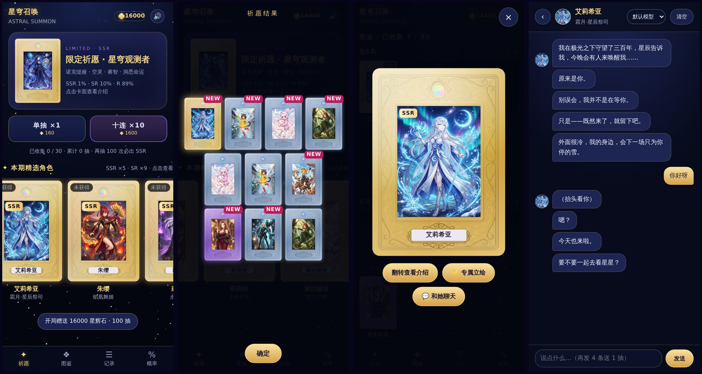

<div align="center">

# 星穹召唤 · Astral Summon

**一款 DeepSeek Harness（dsh）插件：二次元抽卡 + 和你抽到的角色聊天**
**A DeepSeek Harness (dsh) plugin: anime gacha cards you can actually talk to**


[中文](#中文) · [English](#english)



</div>

---

## 中文

### 这是什么
星穹召唤是一个跑在 dsh Web 版里的抽卡小游戏。100 位角色（97 位原创，另有长乐公主、小龙女、克娄巴特拉 3 位历史与经典人物；从幻想世界、古代各国到现代都市里的老师、学生和上班族），每位都有完整的人设、说话习惯和背景故事。抽到谁，就能在游戏里用聊天气泡和她聊天。

- 🎴 **抽卡**：单抽 / 十连，星轨召唤动画，SR 光柱，SSR 全屏演出（先出黑影，再露真容）。
- 📖 **图鉴 / 记录 / 概率**：收集进度、最近 500 抽记录、公开的完整概率表。
- 💬 **角色聊天**：只有抽到的角色才能聊；回复按句子拆成多个气泡，带角色自己的小动作。
- 👥 **群聊**：在图鉴页点「👥 群聊」，选 2～4 位已拥有的角色拉一个群。她们各自回话，用 @名字 互相搭话；你说一句，她们最多回 4 条就停下等你，随时可以点「停止」打断，也可以点「让她们继续聊」。
- 🎁 **星辉石**：开局送 16000（100 抽）；在游戏里和角色每聊完一轮（你说一句、她回完）再送 160（1 抽），群聊同样按轮算。
- 🔒 **不碰你的密钥**：聊天直接用你在 dsh 里已经配好的模型，插件不读取、不保存、不转发任何 API key。

### 概率

| 稀有度 | 卡数 | 概率 |
| --- | --- | --- |
| SSR | 11 | 1% |
| SR | 24 | 10% |
| R | 45 | 89% |

- 同稀有度内每张卡概率均等，单卡概率在游戏「概率」页里全部列出。
- **SSR 保底**：连续 99 抽没出 SSR，第 100 抽必出；出了 SSR 就重新计数。
- 没有 SR 保底。

### 安装
需要 **Node.js 20+** 和 dsh Web 版。

```bash
git clone https://github.com/stargacha/stargacha-.git dsh-astral-summon
npx @deepseek-ai/dsh plugin --profile web add ./dsh-astral-summon
npx @deepseek-ai/dsh web
```

浏览器打开 dsh 后，点左侧边栏的「星穹召唤」开始抽卡。在已拥有角色的详情页点「💬 和她聊天」；在图鉴页点「👥 群聊」可以拉 2～4 人的群。

> 聊天用的是你在 dsh 设置里选的模型。还没配置模型的话，先在 dsh 里配好，插件这边不需要任何设置。

### 隐私与安全
- **存档**：抽卡进度和聊天记录只存在你自己浏览器的 localStorage 里，插件不写任何文件。
- **网络**：唯一的联网动作，是通过 dsh 自带的模型服务把「角色人设 + 聊天规则 + 聊天记录」发给你在 dsh 里选好的模型。不连接 dsh 以外的任何服务器。
- **密钥**：插件不读取、不保存、不返回 API key，密钥始终留在 dsh 内部。
- **访问范围**：聊天和模型列表接口默认只响应本机（loopback + localhost Host 头），挡住局域网调用和 DNS 重绑定。如果你确实把 dsh 开放到了局域网，可以设置环境变量 `ASTRAL_SUMMON_ALLOW_REMOTE=1` 解除限制。
- **不改 dsh**：不注册预设，不改 dsh 的会话、默认模型或工作区；角色只能在游戏里抽到后聊天。
- 全部源码明文、未混淆、未压缩，欢迎审查。

### 目录结构

```
dsh-astral-summon/
├── index.js            # 服务端：提供游戏页面 + /astral-summon/api/*（聊天、模型列表、人设）
├── client.js           # dsh 前端：侧边栏入口 + 主区域 iframe
├── rules.mjs           # 聊天时附加的规则：说话节奏、去 AI 味、角色视角思考、防套话
├── persona-prompt.mjs  # 把人设 JSON 渲染成系统提示词；也能导出 SillyTavern 角色卡
├── personas/           # 每个角色一份人设 JSON（格式见 personas/SCHEMA.md，世界观见 WORLD.md）
├── tavern/             # 同一批角色的 SillyTavern Character Card V2
├── game/               # 游戏页面（单文件 index.html）和卡面、立绘
├── locale/             # 插件名称与描述（中 / 英）
└── docs/               # README 截图
```

### 自己写角色
1. 照 `personas/SCHEMA.md` 写一份 `personas/astral-XX.json`（XX 为两位数卡号）。
2. 把卡面放进 `game/girl_XX.jpg`，并在 `game/index.html` 的 `CARDS` 里加一条。
3. 重新运行 `plugin add` 后重启 dsh。

**稀有度**：在 `CARDS` 那一条里写 `rarity: "SSR"`、`"SR"` 或 `"R"`，人设文件里的 `rarity` 填同样的值。各稀有度的总概率固定（SSR 1% / SR 10% / R 89%），新卡会和同稀有度的卡平分这份概率。SSR 想要全屏立绘演出，还要放 `game/ssr_XX.jpg`（立绘）和 `game/ssr_XX_sil.png`（同尺寸的黑色剪影，透明底），并把卡号加进 `game/index.html` 里 `SPLASH` 那一行的数组；不加也能抽，只是走普通 SSR 演出。

游戏启动时会以人设文件里的名字、头衔和自我介绍为准，所以改人设就够了。

### 已知限制
- 只支持 dsh **Web 版**（`--profile web`），桌面版没有内置网页服务器。
- 存档在浏览器本地，是单机游戏，不防作弊。
- dsh 目前是开发者预览版，升级后插件可能需要跟着调整。

### 许可与致谢
- 源码使用 [PolyForm Noncommercial 1.0.0](LICENSE) 许可：个人学习、研究、非营利使用和修改都可以，**禁止任何商业用途**；转发时需保留许可文本和版权声明。
- 部分角色形象有各自的第三方授权（含非商用条款），去 AI 味规则、角色卡结构等也参考了开源项目，详见 [CREDITS.md](CREDITS.md)。复用 `game/` 里的图片前请先阅读。
- 本项目是社区插件，与 DeepSeek 官方无关联。

---

## English

### What is it
Astral Summon is a gacha mini-game that runs inside the dsh Web UI. It ships 100 characters (97 originals plus 3 historical / classic figures: Princess Changle, Xiaolongnü and Cleopatra), from fantasy worlds and ancient kingdoms to modern-day teachers, students and office workers, each with a full persona, speech habits and backstory. Pull a card and you can chat with that character right inside the game.

- 🎴 **Pulls**: single / 10-pull, star-trail summon animation, SR light pillar, full-screen SSR reveal (silhouette first, then the art).
- 📖 **Collection / History / Rates**: collection progress, your last 500 pulls, and a full public rate table.
- 💬 **Character chat**: only for cards you own. Replies are split into short chat bubbles, with the character's own little actions.
- 🎁 **Star Stones**: 16,000 to start (100 pulls), plus 160 (1 pull) for every 2 messages you send to characters in the game.
- 🔒 **Never touches your keys**: chat uses the model you already set up in dsh. The plugin never reads, stores or forwards any API key.

### Rates

| Rarity | Cards | Rate |
| --- | --- | --- |
| SSR | 11 | 1% |
| SR | 24 | 10% |
| R | 45 | 89% |

- Every card within a rarity has the same chance; per-card rates are listed on the in-game Rates page.
- **SSR pity**: if 99 pulls in a row give no SSR, the 100th pull is a guaranteed SSR. The counter resets on any SSR.
- There is no SR pity.

### Install
Requires **Node.js 20+** and the dsh Web profile.

```bash
git clone https://github.com/stargacha/stargacha-.git dsh-astral-summon
npx @deepseek-ai/dsh plugin --profile web add ./dsh-astral-summon
npx @deepseek-ai/dsh web
```

Open dsh in your browser and click **星穹召唤** in the left sidebar. To chat, open a card you own and press **💬 和她聊天**; for a group chat with 2–4 of your cards, press **👥 群聊** on the collection page.

> Chat uses the model selected in your dsh settings. If you have not set one up yet, do that in dsh first; the plugin itself needs no configuration.

### Privacy & security
- **Saves**: pull progress and chat history live only in your browser's localStorage. The plugin writes no files.
- **Network**: the only network action is sending "character persona + chat rules + chat history" to the model you picked in dsh, through dsh's own model service. No other servers are contacted.
- **Keys**: the plugin never reads, stores or returns API keys; credentials stay inside dsh.
- **Who can call it**: the chat and model-list endpoints answer the local machine only (loopback socket + localhost Host header), which blocks LAN callers and DNS rebinding. If you deliberately expose dsh on your network, set `ASTRAL_SUMMON_ALLOW_REMOTE=1` to lift this.
- **Leaves dsh alone**: no agent presets, no changes to dsh sessions, default model or workspace. Characters are reachable only by pulling them in the game.
- All source is plain, unminified and unobfuscated. Audits welcome.

### Layout

```
dsh-astral-summon/
├── index.js            # host: serves the game + /astral-summon/api/* (chat, models, personas)
├── client.js           # dsh frontend: sidebar entry + main-area iframe
├── rules.mjs           # chat rules: pacing, anti-"AI voice", in-character thinking, anti prompt-leak
├── persona-prompt.mjs  # renders persona JSON into the system prompt; exports SillyTavern cards
├── personas/           # one persona JSON per character (format: personas/SCHEMA.md, lore: WORLD.md)
├── tavern/             # the same characters as SillyTavern Character Card V2 files
├── game/               # the game page (single-file index.html) plus card and splash art
├── locale/             # plugin name and description (zh / en)
└── docs/               # README screenshot
```

### Writing your own character
1. Write `personas/astral-XX.json` following `personas/SCHEMA.md` (XX = two-digit card id).
2. Add the card art as `game/girl_XX.jpg` and an entry to `CARDS` in `game/index.html`.
3. Re-run `plugin add` and restart dsh.

**Rarity**: set `rarity: "SSR"`, `"SR"` or `"R"` in the `CARDS` entry and use the same value in the persona file. Each rarity's total rate is fixed (SSR 1% / SR 10% / R 89%), and cards of the same rarity split it evenly. For the full-screen SSR splash, also add `game/ssr_XX.jpg` (the art) and `game/ssr_XX_sil.png` (a same-size black silhouette on transparency), and add the card id to the `SPLASH` array in `game/index.html`; without them the card still works with the standard SSR reveal.

On load the game takes each card's name, title and intro from its persona file, so editing the persona is enough.

### Known limitations
- dsh **Web profile** only (`--profile web`); the desktop app has no built-in web server.
- Saves are local to your browser. It's a single-player game with no anti-cheat.
- dsh is still a developer preview; the plugin may need updates when dsh changes.

### License & credits
- Source code: [PolyForm Noncommercial 1.0.0](LICENSE). Free for personal, research and other noncommercial use and modification; **no commercial use**. Keep the license and copyright notice when sharing.
- Some character designs carry their own third-party terms (including non-commercial ones), and several open-source projects inspired the chat rules and card format. See [CREDITS.md](CREDITS.md), and read it before reusing any image from `game/`.
- This is a community plugin and is not affiliated with DeepSeek.
